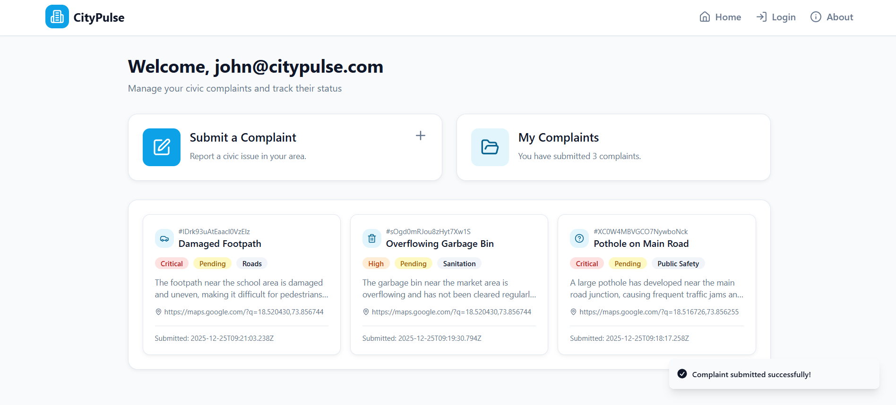
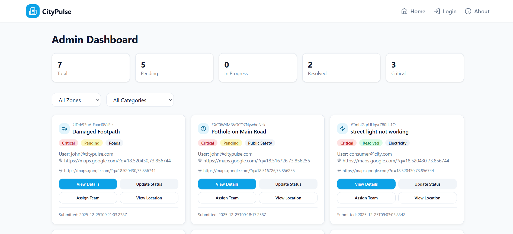

#  🏙️CityPulse – Public Complaint Prioritizer

## 📌 Project Description
CityPulse is a smart, web-based civic complaint management system designed to simplify how citizens report issues and how authorities resolve them. It enables users to submit complaints online with images and location details, while administrators can efficiently manage and prioritize complaints using NLP-based analysis. The system promotes transparency, faster resolution, and improved urban governance.

---

## 🎯 Objectives
- To digitize the civic complaint submission process
- To reduce response time through priority-based complaint sorting
- To provide a centralized platform for users and administrators
- To enhance transparency and accountability in issue resolution

---

## ✨ Key Features
- Secure user authentication (Login & Signup)
- Consumer Dashboard for Online complaint submission with image upload
- NLP-based priority classification of complaints
- Admin dashboard for complaint monitoring and status updates
- Google Maps integration for complaint location detection
- Cloud-based image storage using Cloudinary
- Real-time data storage with Firebase

---

## 🛠️ Tech Stack
- **Frontend:** React.js with TypeScript, HTML, CSS, JavaScript  
- **Backend:** Firebase  
- **Database:** Firebase Firestore  
- **Authentication:** Firebase Authentication  
- **Image Storage:** Cloudinary  
- **Maps:** Google Maps API  
- **Hosting:** Firebase Hosting  
- **NLP:** Text-based priority analysis

---

## 👤 System Users / Roles

### 👥 User
- Register and log in securely  
- Submit complaints with images and location  
- View complaint details and status updates  

### 🛠️ Admin
- View all submitted complaints  
- Analyze complaints based on priority  
- Update complaint status (Pending / In Progress / Resolved)  

---

## 🔄 Project Workflow
User submits complaint →  
Complaint stored in Firebase →  
NLP analyzes complaint priority →  
Admin reviews via dashboard →  
Complaint resolved and status updated

---

## 📸 Screenshots
_(Screenshots included for visual understanding)_
  
- Consumer Dashboard 
- Complaint Submission Form  
- Admin Dashboard  
- View details of complaint at Admin

### 🔹Consumer Dashboard

### 🔹Complaint Submission Form

### 🔹Admin Dashboard

### 🔹View details of complaint at Admin

---

## 🌐 Live Project
🔗 **Live Website:**  https://cityfire-2e8c6.web.app

---

## 🎥 Demo Video
A complete walkthrough of CityPulse demonstrating user complaint submission, priority sorting, admin management, and resolution flow.

👉 **Watch Demo Video:** https://drive.google.com/file/d/1zYCT0D2_nc_FK1jpIyumBknTfzgJWWFs/view?usp=drivesdk

---

## 🚀 How to Run CityPulse Locally

## 1️⃣Step 1: Prerequisites
Before starting, make sure you have installed:

- **Node.js & npm**  
  Download: [https://nodejs.org](https://nodejs.org)  
  Install the latest LTS version

- **Git** (optional if you clone from GitHub)  
  Download: [https://git-scm.com](https://git-scm.com)

- **Code Editor**  
  VS Code recommended: [https://code.visualstudio.com](https://code.visualstudio.com)

---

## 2️⃣Step 2:📥 Getting Started

### 1. Clone the Repository
Open your terminal and run the following:

* git clone https://github.com/your-username/citypulse.git
cd citypulse
* **Replace your-username with your actual GitHub username.**
- cd citypulse_final
- cd citypulse-frontend-main

### 2. Install Dependencies
Install the required React and Firebase packages:

* **npm install**

- **Firebase Configuration**
   Create Firebase Project
   
   Go to https://console.firebase.google.com

   Click Add Project

   Complete the setup wizard

   Enable Firebase Services

   Authentication

   Enable Email/Password sign-in method

   Firestore Database

   Create a database in Test Mode

   Storage

---

## 3️⃣Step 3:
## Image Uploading at the consumer dashboard:
### 🌩️ CLOUDINARY SETUP 

### ✅ 1: Create Cloudinary Account

1. Go to 👉 **[https://cloudinary.com/](https://cloudinary.com/)**
2. Sign up (free)
3. Login to *Cloudinary Dashboard*

---

### ✅ 2: Get Cloud Name

1. In Dashboard → top-right corner
2. Copy *Cloud Name*

Example:

cloud_name: citypulse123

You will use this in the API URL.

---

### ✅ 3: Create Upload Preset

1. Go to *Settings* ⚙️
2. Open *Upload* tab
3. Scroll to *Upload presets*
4. Click *Add upload preset*

Fill:

* *Preset name* → citypulse_preset
* *Signing Mode* → Unsigned ✅ (IMPORTANT)
* *Folder* → complaints (optional but recommended)
* *Allowed formats* → jpg,png,jpeg,webp

Click *Save*

---

### ✅ 4: Update Your Code (IMPORTANT)

Replace *your Cloudinary file* with this 👇

ts
export const uploadToCloudinary = async (file: File): Promise<string> => {
  const formData = new FormData();
  formData.append("file", file);
  formData.append("upload_preset", "citypulse_preset"); // 👈 your preset

  const res = await fetch(
    "https://api.cloudinary.com/v1_1/citypulse123/image/upload", // 👈 your cloud name
    {
      method: "POST",
      body: formData,
    }
  );

  if (!res.ok) {
    throw new Error("Cloudinary upload failed");
  }

  const data = await res.json();
  return data.secure_url;
};

**Add cloud name,preset name in cloudinary.js file in lib\cloudinary.ts**

🔴 Replace:

* citypulse_preset → *your preset name*
* citypulse123 → *your cloud name*

---

### ✅ 5: Test Image Upload

1. Run your app:

bash
npm run dev

2. Submit a complaint with an image
3. Open *Cloudinary → Media Library*
4. You should see the uploaded image 🎉

---

## 4️⃣Step 4: Connect Firebase to Application
- Go to Project Settings → General

- Under Your apps, click the Web (</>) icon

- Copy the Firebase configuration and add it to:
.env file which you will create at the same level as package.json

const firebaseConfig = {
  apiKey: "YOUR_API_KEY",

  authDomain: "YOUR_PROJECT.firebaseapp.com",

  projectId: "YOUR_PROJECT_ID",

  storageBucket: "YOUR_PROJECT.appspot.com",

  messagingSenderId: "YOUR_SENDER_ID",

  appId: "YOUR_APP_ID"

};

## 5️⃣Step 5: Firebase CLI Setup (Optional)
- Login to Firebase:

- firebase login

- Initialize Firebase in the project:

- firebase init

**Running the Application**
Start the development server:
- npm run dev

**Open the application in your browser:**

- http://localhost:port_no

## 6️⃣Step 6: Testing Features
- User signup and login

- Submit complaint with image upload

- View sorted complaints in admin dashboard

- Update complaint status and verify changes in Firestore

# ⭐Admin Details: 
## Username: admin@citypulse.com  
## Password: admin1234

---

## 7️⃣Step 7: Firebase Hosting
Install Firebase CLI
- Install Firebase CLI globally:

**npm install -g firebase-tools**

### Login to Firebase:
- firebase login
- Create Firebase Project
- Go to https://console.firebase.google.com
- Click Add Project
- Follow the setup steps to create a new project
- Initialize Firebase in Project
- Open terminal in your project root folder
Run:
- firebase init
Select Hosting
- Choose Use an existing project
- Select your Firebase project
Set public directory as:
- dist

Configure as a single-page app: Yes

Do NOT overwrite index.html

##  Build the Project
Create a production build:
- npm run build
This generates a build/ folder

## Deploy to Firebase Hosting
Deploy the project:
- firebase deploy

## After successful deployment, Firebase will provide a live URL
Access Live Website
Open the provided URL in browser
- Your project is now live on Firebase Hosting

## Redeploy After Changes
After making changes:

- npm run build
- firebase deploy

## 🔮Future Enhancements: 
- **Multi-Language Support:** Enable complaint submission in multiple regional languages using AI-based translation.
- **Real-Time User Notifications:** Send instant email, SMS, or in-app alerts for complaint status updates.
- **Advanced Feedback & Rating System:** Collect user feedback after resolution to improve service quality and accountability.
- **Duplicate & Spam Complaint Detection:** Apply AI to identify duplicate or fake complaints and reduce system overload.
- **Mobile Application Integration:** Extend the system with an Android/iOS app for better accessibility.
- **Voice-Based Complaint Registration:** Allow users to register complaints using voice input with speech-to-text support.

